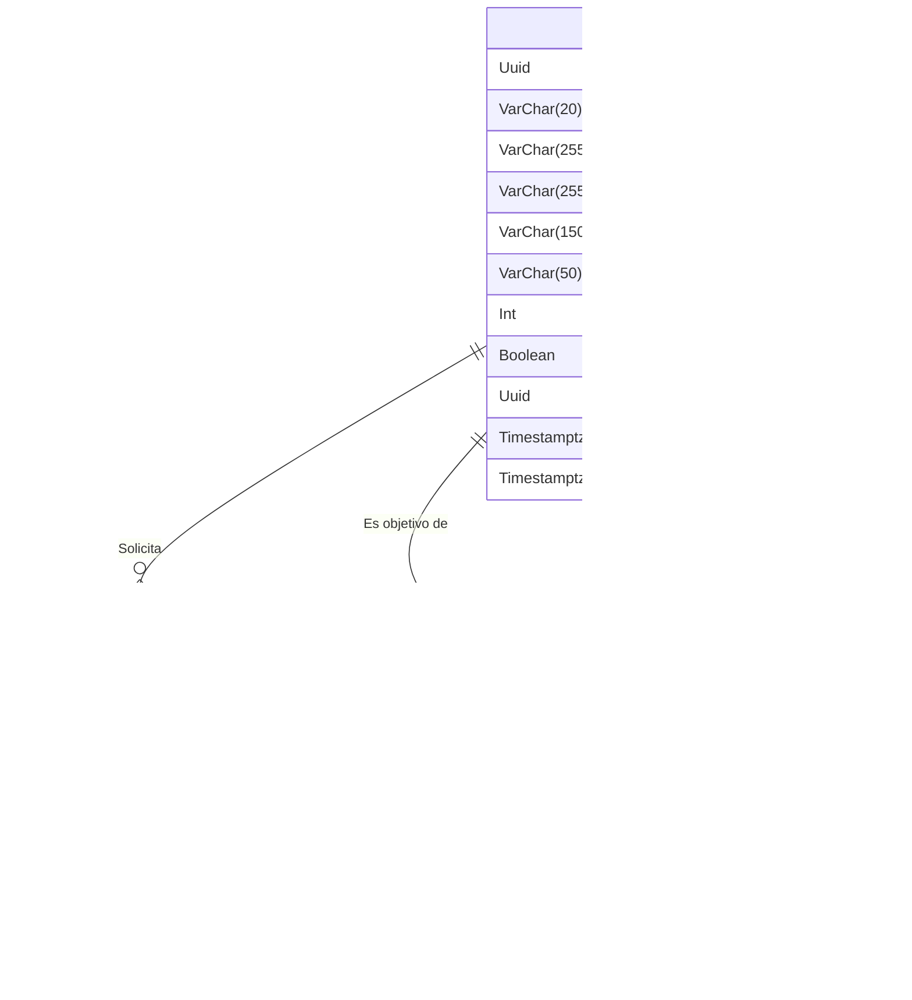

# Diagrama Relacional - Auth Squad

```mermaid
erDiagram
    users {
        Uuid uuid PK
        VarChar(20) rut UK
        VarChar(255) email UK
        VarChar(255) password_hash
        VarChar(150) nombre
        VarChar(50) rol
        Int token_version
        Boolean cambio_obligatorio
        Uuid creado_por_id FK
        Timestamptz created_at
        Timestamptz updated_at
    }

    password_reset_tokens {
        Uuid id PK
        Uuid user_uuid FK
        VarChar(255) token_hash UK
        Timestamptz expires_at
        Timestamptz used_at
        Timestamptz created_at
    }

    session_revocada {
        Uuid id PK
        Uuid target_user_id FK
        Uuid revoked_by FK
        Text reason
        Timestamptz revoked_at
    }

    users ||--o{ users : "Crea subordinados"
    users ||--o{ password_reset_tokens : "Solicita"
    users ||--o{ session_revocada : "Es objetivo de"
    users ||--o{ session_revocada : "Ejecuta revocación"
```
